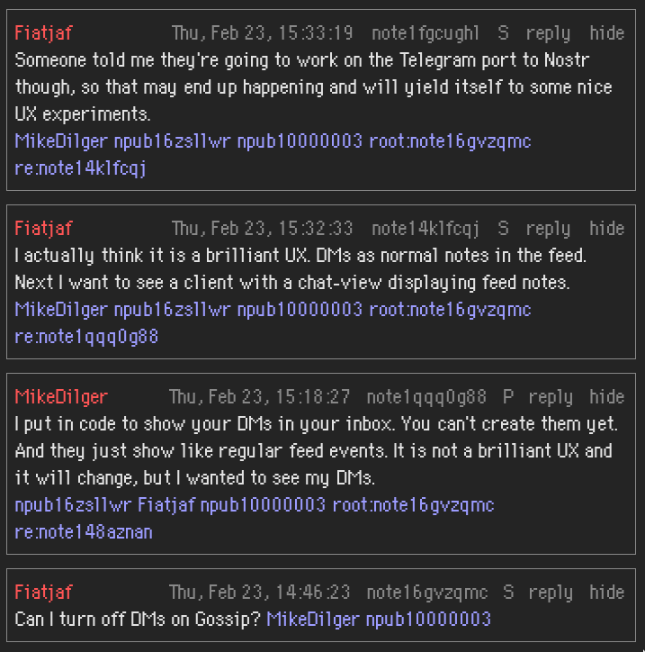

# react-ts-client
React + TS Nostr Client with https://vitejs.dev.



Need to have `node`. Recommend using https://github.com/nvm-sh/nvm if you have not used `node`, `npm`, before.

# Run locally
```zsh
npm install
npm run dev
```

# Build for production
```zsh
npm run build
```
